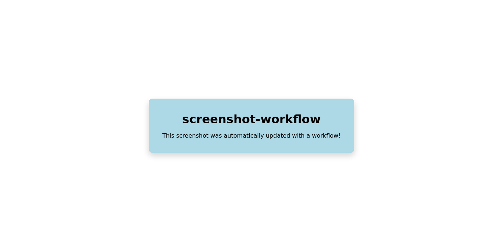

## How to use this workflow

Add a file in `.github/workflows/` containing the following lines  in the project repository, changing the paths to `input_html_path`, `output_png_path`, and `md_path.md` :

```yml
name: screenshot

on:
  push:
    paths:
      - '**/*.html'
      - '**/*.css'
      - '**/*.js'
  pull_request:
    paths:
      - '**/*.html'
      - '**/*.css'
      - '**/*.js'
  workflow_dispatch:

permissions:
    contents: write

jobs:
  screenshot:
    uses: abeslier/screenshot-workflow/.github/workflows/screenshot.yml@main
    with:
        input_html_path: "path/to/index.html"
        output_png_path: "path/to/screenshot.png"
        md_path: "path/to/doc.md"
```

Add the screenshot to the markdown file (e.g. `README.md`):

```md

```

The screenshot will be automatically updated acording to the [`on`](https://docs.github.com/en/actions/writing-workflows/workflow-syntax-for-github-actions#on) section of the created workflow file (every time a change is made to any *.html*, *.css*, or *.js* file in the example above). 

`workflow_dispatch` allows to manually execute the workflow from the *Actions* tab of the project's repository on GitHub.

## Example result



## Sources

- https://docs.github.com/en/actions/writing-workflows/workflow-syntax-for-github-actions
- https://docs.github.com/en/actions/sharing-automations/reusing-workflows
- https://www.selenium.dev/documentation/webdriver/browsers/firefox/
- https://github.com/GoogleChrome/chrome-launcher/blob/main/docs/chrome-flags-for-tools.md
